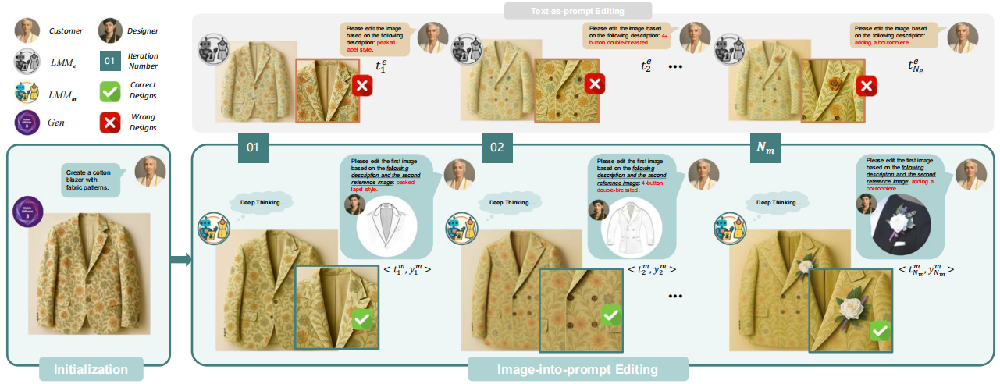

# FashionEdit

FashionEdit is a playground for experimenting with AI-powered fashion editing tools. This project leverages deep learning libraries such as PyTorch and Transformers to enable image manipulation and style transfer for fashion-related images.



## Features

- AI-based fashion image editing
- Style transfer and garment manipulation
- Integration with popular deep learning frameworks

## Setup

1. **Clone the repository:**
   ```bash
   git clone https://github.com/yourusername/FashionEdit.git
   cd FashionEdit
   ```

2. **Create and activate the conda environment:**
   ```bash
   conda env create -f environment.yml
   conda activate fashionedit
   ```

## Methology

1. Download the original dataset DeepFashion-MultiModal from: https://github.com/yumingj/DeepFashion-MultiModal
    ```bash
    data/captions.json
    data/images
   ```

2. The original dataset is generated by SD3:
   ```bash
    python SD3.py
   ```

3. We select the top 11546 CLIP score results:
    The scores and file names: captions_top.json

    The generated resized images: https://pan.quark.cn/s/791132839ab9

    The original resized images: https://pan.quark.cn/s/68377fe9f7cd

4. (option) We use gpt-4.1-mini to find the top three difference between the generated images and the original image:
   ```bash
    python diff.py # ChatGPT API request here
   ```
    You can modify the diff.py file and save the cut results loaded from the results: diff.json 

5. The edit methods are:
   ```bash
    python TextEdit.py  #or TextImageEdit.py, ChatGPT API request here
   ```

    The text based modified images (1,2,3 steps): https://pan.quark.cn/s/cd385e97a724

    The text+image modified images (1,2,3 steps): https://pan.quark.cn/s/4ebd811b82b2

6. The Evaluation is from:
   ```bash
    python CILP.py
   ```

## License
This project is licensed under the MIT License.